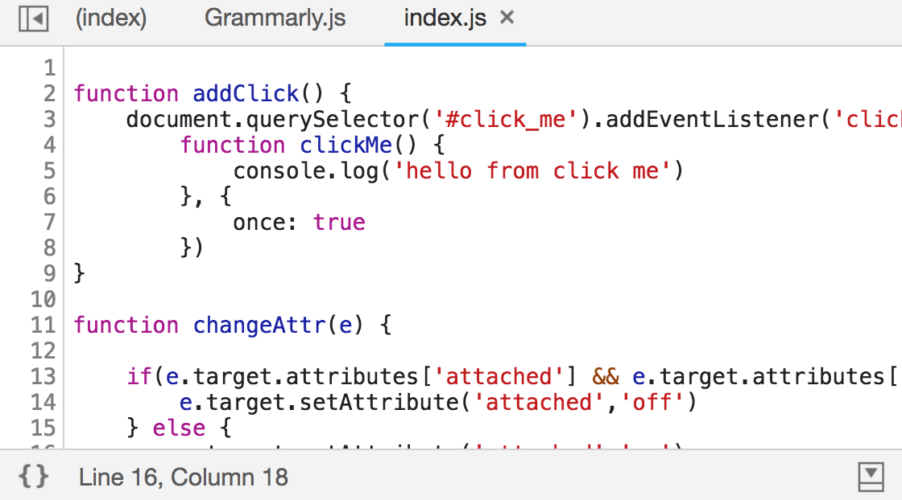
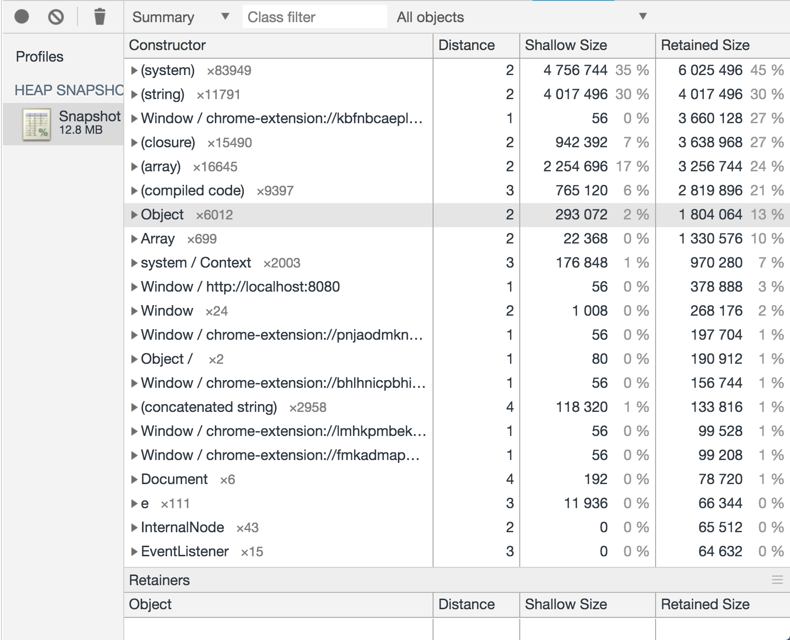

# DEV TOOLS

deep dive to CHROME DEV TOOLS

## ELEMENTS overview

view the element panel.

there are two main view in the element panel

* element tree
* element explorer

### element tree

view the element that are currently on the `Document`

once click on element the element explore tab filled with details about the element and in the bottom of the tree tab the rooted of the element display as breadcrumbs

### element explorer

a rich detail about the element that is currently selected in the tree

## ELEMENTS explorer

explore the elements.

### Styles

* add style to element
* add class to element
* toggle element state
* view your changes

### Computed

* high light elements' margin, border, padding and box
* get the source of css apply on the element

### Event Listeners

* get event that attached to element and his ancestors
* remove events
* get the source of the event

### DOM Breakpoints

* attribute change
* element remove
* sub tree attached

### Extra

* properties: get the DOM element
* accessibility: get the ARIA

## NETWORK: the panel

get familiar with the panel

By default, DevTools records all network requests.

### Stop requests

To stop recording requests: Click stop recording network.

### Clear requests

Click clear on the Network panel.

### Save previous requests

To save requests across page loads, check the Preserve log checkbox on the Network panel.

### Enable screenshots

To enable screenshots, click Capture screenshots Capture screenshots on the Network panel.

### Replay an XHR request

To replay an XHR request, right-click the request in the Requests table and select Replay XHR.

### Disable cache I

check the Disable cache checkbox, on the tool bar.

### Disable cache II

right-click anywhere in the Requests table and select Clear Browser Cache.

### Completely offline network

Check the Offline checkbox to simulate a completely offline network experience

### Emulate slow network

Emulate slow network connections from the Network Throttling menu

### Override the user agent

Override the user agent and emulate slow network connections from the Network Conditions drawer

### Filter requests by properties I

Use the Filter text box to filter requests by properties, such as the domain or size of the request.

### Filter requests by properties II

You can use multiple properties simultaneously by separating each property with a space. For example: `mime-type:image/gif larger-than:1K`

### Filter requests by type

filter requests by request type. To enable multiple type filters simultaneously, hold Command (Mac) or Control (Windows, Linux) and then click.

### Filter requests by time

Click and drag left or right on the Overview pane to only display requests that were active during that time frame.

The filter is inclusive. Any request that was active during the highlighted time is shown.

### Search in the network

Click the magnify glass or click Command (Mac) or Control (Windows, Linux), F

Search across all network headers and response bodies in the Network Panel.

Searching by regular expression is also supported.

### View initiators and dependencies

To view the initiators and dependencies of a request, hold Shift and hover over the request in the Requests table. DevTools colors initiators green, and dependencies red.

### View load events

* DevTools displays the timing of the `DOMContentLoaded` and `load` events in multiple places on the Network panel.
* The `DOMContentLoaded` event is colored blue.
* the `load` event is red.

### View the stack trace that caused a request

When a JavaScript statement causes a resource to be requested, hover over the Initiator column to view the stack trace leading up to the request.

## Export requests data

Save all network requests to a HAR file

* Right-click any request in the Requests table.
* Select Save as HAR with Content.
  * DevTools saves all requests that have occurred since you opened DevTools to the HAR file.
  * There is no way to filter requests, or to save just a single request.

## Import requests data

* Right-click any request in the Requests table.
* Drag the `har` file to the Network Panel

## NETWORK: Request Table

The Requests table displays the following columns by default:

* Name: The filename of, or an identifier for, the resource.
* Status: The HTTP status code.
* Type: The MIME type of the requested resource.

* Initiator: The following objects or processes can initiate requests:
  * Parser: Chrome's HTML parser.
  * Redirect: An HTTP redirect.
  * Script: A JavaScript function.
  * Other: Some other process or action, such as navigating to a page via a link or entering a URL in the address bar.

* Size: The combined size of the response headers plus the response body, as delivered by the server.
* Time: The total duration, from the start of the request to the receipt of the final byte in the response.
* Waterfall: A visual breakdown of each request's activity.

### Add or remove columns

* Right-click the header of the Requests table and select an option to hide or show it.
* Currently displayed options have checkmarks next to them.
* To add a custom column to the Requests table:
  * right-click the header of the Requests table
  * select Response Headers > Manage Header Columns.

### View a response body

* Click the URL of the request, under the Name column of the Requests table.
* Click the Response tab.

### View HTTP headers

* Click on the URL of the request, under the Name column of the Requests table.
* Click the Headers tab.

### View HTTP headers Query String

* To view the query string parameters of a URL in a human-readable format go to the Query String Parameters section

### View HTTP headers view source

* To view the HTTP header names in the order they were received click view source, next to the Request Header or Response Header section.

## Network: Resource Timing

Understanding the browser network resource timing

* All network requests are considered resources.
* As they are retrieved over the network, resources have distinct lifecycles expressed in terms of resource timing.
* The Network Panel uses the same Resource [Timing API](https://www.w3.org/TR/resource-timing/) that is available to application developers.

### Resource timing

### Redirect

* Immediately begins `startTime`.
* If a redirect is happening, `redirectStart` begins as well.
* If a redirect is occurring at the end of this phase then `redirectEnd` will be taken.

### App Cache

If it’s application cache fulfilling the request, a `fetchStart` time will be taken.

### DNS

* `domainLookupStart` time is taken at the beginning of the DNS request.
* `domainLookupEnd` time is taken at the end of the DNS request.

### TCP

* `connectStart` is taken when initially connecting to the server.
* If TLS or SSL are in use then `secureConnectionStart` will start when the handshake begins for securing the connection.
* `connectEnd` is taken when the connection to the server is complete.

### Request

* `requestStart` is taken once the request for a resource has been sent to the server.

### Response

* `responseStart` is the time when the server initially responds to the request.
* `responseEnd` is the time when the request ends and the data is retrieved.

### Resource Timing API

* run the command `performance.getEntriesByType('resource')` in the Console will show the raw data of resource the.

## NETWORK: Diagnose

Network diagnose in the dev tool

### Timing information

To view the full timing information for a given entry of the Network Panel you have two options.

* Hover the timing graph under the timeline column.
* Click on any entry and open the Timing tab of that entry.

### Queuing

A request being queued indicates that:

* The request was postponed by the rendering engine because it's considered lower priority than critical resources.
* The request was put on hold to wait for an unavailable TCP.
* The request was put on hold because the browser only allows six TCP connections per origin on HTTP 1.*
* Time spent making disk cache entries

### Stalled/Blocking

* Time the request spent waiting before it could be sent. It can be waiting for any of the reasons described for Queueing.
* Additionally, this time is inclusive of any time spent in proxy negotiation.

### Proxy Negotiation

* Time spent negotiating with a proxy server connection.

### DNS Lookup

* Time spent performing the DNS lookup. Every new domain on a page requires a full roundtrip to do the DNS lookup.

### Initial Connection / Connecting

* Time it took to establish a connection, including TCP handshakes/retries and negotiating a SSL.

### SSL

* Time spent completing a SSL handshake.

### Request Sent / Sending

* Time spent issuing the network request. Typically a fraction of a millisecond.

### Waiting (TTFB)

* Time spent waiting for the initial response, also known as the Time To First Byte. This time captures the latency of a round trip to the server in addition to the time spent waiting for the server to deliver the response.

### Content Download / Downloading

* Time spent receiving the response data.

## NETWORK: known issues

### Queued or stalled requests: Symptoms

* Six requests are downloading simultaneously.
* After that, a series of requests are queued or stalled.
* Once one of the first six requests finishes, one of the requests in the queue starts.

### Queued or stalled requests: Symptoms II

### Queued or stalled requests: Fixes

* Implement domain sharding if you must use HTTP/1.0 or HTTP/1.1.
* Use HTTP/2. Don't use domain sharding with HTTP/2.
* Remove or defer unnecessary requests so that critical requests can download earlier.

### Slow Time To First Byte: Symptoms

A request spends a long time waiting to receive the first byte from the server.

### Slow Time To First Byte: Fixes

* If the connection is slow, consider hosting your content on a CDN or changing hosting providers.
* If the server is slow, consider optimizing database queries, implementing a cache, or modifying your server configuration.

### Slow content download: Symptoms

* A request takes a long time to download.

### Slow content download: Fixes

* Consider hosting your content on a CDN or changing hosting providers.
* Send fewer bytes by optimizing your requests.

## SOURCES: Over view

Get familiar with the Sources panel UI

The Sources panel UI has 3 parts:

### The File Navigator pane

Every file that the page requests is listed here.

### The Code Editor pane.

After selecting a file in the File Navigator pane, the contents of that file are displayed here.

### The JavaScript Debugging pane.

Various tools for inspecting the page's JavaScript. If your DevTools window is wide, this pane is displayed to the right of the Code Editor pane

## SOURCES: Breakpoints

Pause Your Code With Breakpoints

there are six type of breakpoints.

### Line-of-code

On an exact region of code.

Use a line-of-code breakpoint when you know the exact region of code that you need to investigate. DevTools always pauses before this line of code is executed.

blue breakpoint

### Conditional line-of-code

On an exact region of code, but only when some other condition is true.

Use a conditional line-of-code breakpoint when you know the exact region of code that you need to investigate, but you want to pause only when some other condition is true.

orange breakpoint

### DOM

Use a DOM change breakpoint when you want to pause on the code that changes a DOM node or its children.

#### Types of DOM change breakpoints

* **Subtree modifications**: Triggered when a child of the currently-selected node is removed or added, or the contents of a child are changed.
* **Attributes modifications**: Triggered when an attribute is added or removed on the currently-selected node, or when an attribute value changes.
* **Node Removal**: Triggered when the currently-selected node is removed.

### XHR

Use an XHR breakpoint when you want to break when the request URL of an XHR contains a specified string.

### Event listener

* Use event listener breakpoints when you want to pause on the event listener code that runs after an event is fired. 
* You can select specific events, such as click, or categories of events, such as all mouse events.

### Exception

* Use exception breakpoints when you want to pause on the line of code that's throwing a caught or uncaught exception.

### Function

* Call `debug(functionName)` when you want to pause whenever a specific function is called. 
* can insert `debug()` into your code (like a console.log() statement) or call it from the DevTools Console.
* `debug()` is equivalent to setting a line-of-code breakpoint on the first line of the function.

## SOURCES: Call Stack

working with the source call stack

### Restart Frame

Restart the top function of the call stack

### Blackbox scripts

* When blackboxed, a script is obscured in the Call Stack pane, and you never step into the script's functions when you step through your code.

* blackbox a single script or pattern of scripts from Settings

## SOURCES: Snippets

run and save custom code

Snippets are small scripts that you can author and execute within the Sources panel of Chrome DevTools.

You can access and run them from any page.

When you run a snippet, it executes from the context of the currently open page.

### Create snippet

* To create a snippet, open the Sources panel, click on the Snippets tab, right-click within the Navigator, and then select New.
* Enter your code in the editor
* Save.

### Run snippet

There are four ways to run your snippet:

* Right-click on the snippet filename and select Run.
* Click the Run button.
* Press Command+Enter (Mac) or Ctrl+Enter (Windows, Linux).
* open the command panel Command+P (Mac) or Ctrl+P (Windows, Linux), write exclamation point and the name of the snippet

## SOURCES: Overrides

Map remote network resources to local filesystem resources.

* Open up the `Overrides` pane from the Sources Panel.
* Select `Select folder for Overrides` and configure a folder where your overridden resources will live on the filesystem.
* In the `Network Panel`, right click on a resource you wish to override and select `Save for overrides`.
* DevTools creates a local resource which you can edit. Reloads to the webpage now serve your local asset rather than a remote resource.

## Memory: Terminology

common terms used in memory analysis

Think of memory as a graph with primitive types (like numbers and strings) and objects (associative arrays).

It might visually be represented as a graph with a number of interconnected points as follows:

An object can hold memory in two ways:

* Directly by the object itself.
* Implicitly by holding references to other objects, and therefore preventing those objects from being automatically disposed by a garbage collector (GC for short).

### Shallow size

The size of memory that is held by the object itself.

### Retained size

The size of memory that is freed once the object itself is deleted along with its dependent objects that were made unreachable from GC roots.

### Objects retaining tree

The heap is a network of interconnected objects. In the mathematical world, this structure is called a graph or memory graph. A graph is constructed from nodes connected by means of edges, both of which are given labels.

* Nodes (or objects) are labelled using the name of the constructor function that was used to build them.
* Edges are labelled using the names of properties.

## Memory: Heap Snapshots

### Take a snapshot

On the Profiles panel, choose Take Heap Snapshot, then click take snapshot

Snapshots are initially stored in the renderer process memory

## View snapshots

View snapshots from different perspectives for different tasks.

### Summary view

shows objects grouped by the constructor name.
Use it to hunt down objects (and their memory use) based on type grouped by constructor name.
It's particularly helpful for tracking down DOM leaks.

### Summery columns

* **Constructor** represents all objects created using this constructor. Number of object instances is displayed after the constructor name.
* **Distance** displays the distance to the root using the shortest simple path of nodes.
* **Shallow size** column displays the sum of shallow sizes of all objects created by a certain constructor function.
* **Retained size** column displays the maximum retained size among the same set of objects.
* **Retainers** column displays a drill down on the object ancestors in the tree.

### class filter

filter the constructor by entering string to the class filter

### compare two snapshots

near the class filter input there is a dorp down that display show, in the summary view, the object that exist in the current snapshot but not in the previous snapshot

### Containment view

The Containment view is essentially a "bird's eye view" of your application's objects structure.

It allows you to peek inside function closures, to observe VM internal objects that together make up your JavaScript objects, and to understand how much memory your application uses at a very low level.

The view provides several entry points:

* **DOMWindow** objects are objects considered as "global" objects for JavaScript code.
* **GC roots** are the actual GC roots used by VM's garbage. GC roots can be comprised of built-in object maps, symbol tables, VM thread stacks, compilation caches, handle scopes, global handles.
* **Native objects** are browser objects "pushed" inside the JavaScript virtual machine to allow automation, for example, DOM nodes, CSS rules.

### finding memory leak

[DEMO](./memory/leak.html)

## Reference

* [Network Analysis Reference](https://developers.google.com/web/tools/chrome-devtools/network-performance/reference)
* [Understanding Resource Timing](https://developers.google.com/web/tools/chrome-devtools/network-performance/understanding-resource-timing)
* [Network Issues Guide](https://developers.google.com/web/tools/chrome-devtools/network-performance/issues)
* [Resource Timing Level 1](https://www.w3.org/TR/resource-timing/)
* [dev-tips](https://umaar.com/dev-tips/)
* [Pause Your Code With Breakpoints](https://developers.google.com/web/tools/chrome-devtools/javascript/breakpoints)
* [JavaScript Debugging Reference](https://developers.google.com/web/tools/chrome-devtools/javascript/reference)
* [Run Snippets Of Code From Any Page](https://developers.google.com/web/tools/chrome-devtools/snippets)
* [Memory Terminology](https://developers.google.com/web/tools/chrome-devtools/memory-problems/memory-101)

# Ran Itzhaki 
* [zamboney@gmail.com](mailto:zamboney@gmail.com)
* https://github.com/zamboney
* https://www.linkedin.com/in/ran-itzhaki-b1847a110/

# THANK YOU!!!
